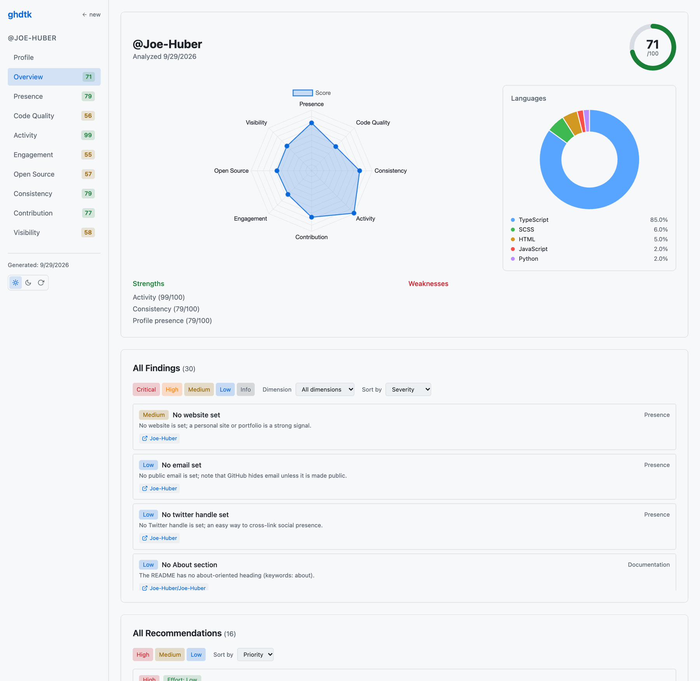
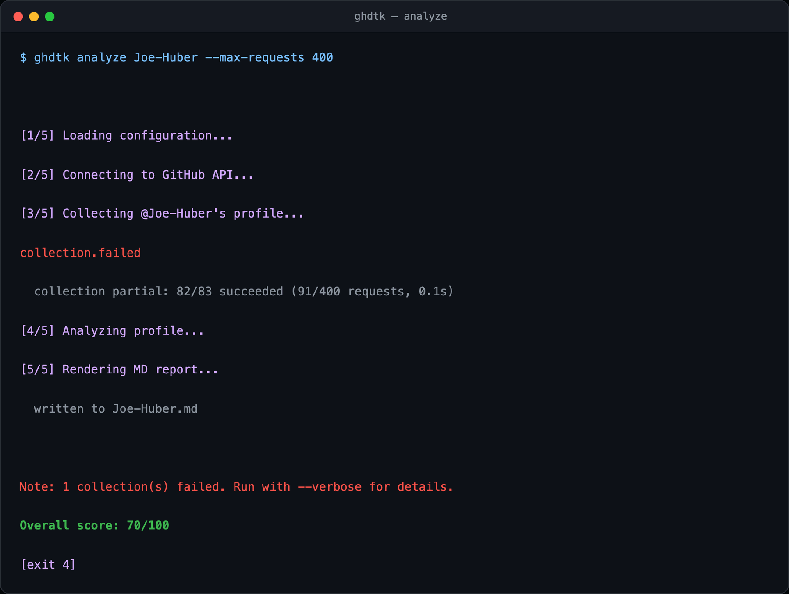
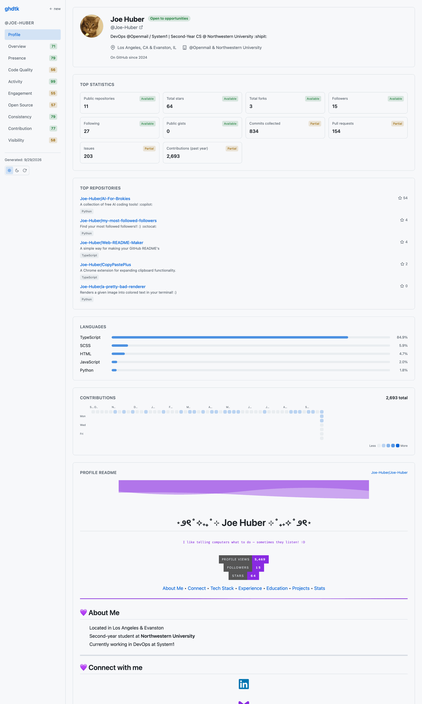
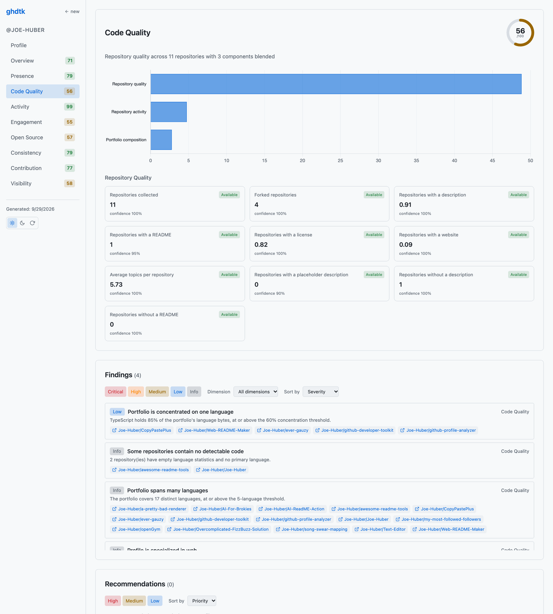
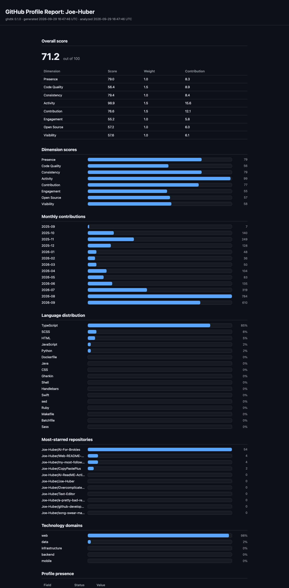

<div align="center">

# GitHub Developer Toolkit :octocat:

**Turn your GitHub profile into an explainable, evidence-backed score — and a web dashboard you can actually act on.**

[](https://github.com/Joe-Huber/github-developer-toolkit/stargazers)
[](https://github.com/Joe-Huber/github-developer-toolkit/network/members)
[](https://github.com/Joe-Huber/github-developer-toolkit/issues)
[](https://github.com/Joe-Huber/github-developer-toolkit/graphs/contributors)

[](https://www.python.org/)
[](https://docs.astral.sh/uv/)
[](pyproject.toml)
[](dashboard-ui/)
[](src/ghdtk/dashboard/)
[](dashboard-ui/)
[](https://github.com/Joe-Huber/github-developer-toolkit/actions/workflows/ci.yml)
[](LICENSE)



</div>

---

## What it does

`ghdtk` collects a public GitHub profile and turns it into **explainable metrics, 8 dimension scores, findings, and prioritized recommendations** — never a black-box number.

- **Evidence-backed.** Every metric carries provenance back to the exact API field that produced it. Every score breaks down into weighted components that sum to the score.
- **Read-only.** No writes, ever. Any valid token works; add the `repo` scope to include private repositories.
- **Three output formats.** Markdown, JSON, and a self-contained HTML report.
- **Interactive dashboard.** FastAPI + React, served by the same CLI.

## Quick start

Requires Python 3.11+ and [uv](https://docs.astral.sh/uv/).

```sh
git clone https://github.com/Joe-Huber/github-developer-toolkit.git
cd github-developer-toolkit

uv sync --extra dashboard

# a read-only token: https://github.com/settings/tokens
export GHDTK_GITHUB_TOKEN=ghp_your_token_here

uv run ghdtk dashboard octocat    # -> http://127.0.0.1:8000
```

Prefer a file report?

```sh
uv run ghdtk analyze octocat                     # writes octocat.md
uv run ghdtk analyze octocat -f html -o out.html # self-contained HTML
```

`uv run ghdtk --help` lists every flag; [docs/cli.md](docs/cli.md) documents them all.

<p align="center">
  
</p>

<p align="center"><sub>Progress goes to stderr, the score to stdout. <code>-f json</code> and <code>-f html</code> switch the output format; <code>-o</code> sets the filename.</sub></p>

## Screenshots

<p align="center">
  
  
</p>

<p align="center"><sub>Profile page and Code Quality dimension tab. Every metric is labelled <code>available</code>, <code>partial</code>, or <code>unavailable</code> so you always know what the score is really based on.</sub></p>

`ghdtk analyze -f html` renders the same report as a single self-contained file — no network, no assets, byte-identical for identical input. Handy for archiving or attaching to a PR.

<p align="center">
  
</p>

## How it scores

Eight dimensions, each scored 0–100, aggregated into one weighted overall score.

| Dimension | Weight | Measures |
| --- | --- | --- |
| Profile presence | 1.0 | Field completeness, profile README quality |
| Code quality | 1.5 | Repo quality, activity, portfolio composition |
| Activity | 1.5 | Commit volume, cadence, active-day breadth |
| Contribution | 1.5 | Contribution volume, density, streaks and gaps |
| Consistency | 1.0 | Commit and calendar regularity |
| Engagement | 1.0 | Follower audience, balance, network reach |
| Open source | 1.0 | PR volume, merge rate, external and review collaboration |
| Visibility | 1.0 | Portfolio stars, language diversity |

Thresholds, normalization, and known data limitations are documented in [docs/methodology.md](docs/methodology.md).

## Design principle

Raw GitHub data and derived analysis are strictly separated. API payloads become **frozen** typed snapshots and are never mutated; everything else is computed from them. That is what makes provenance, reproducibility, and the offline test corpus possible. See [docs/architecture.md](docs/architecture.md).

## Documentation

| | |
| --- | --- |
| [CLI guide](docs/cli.md) | Every command, flag, and exit code |
| [Methodology](docs/methodology.md) | How every metric is computed and weighted |
| [Architecture](docs/architecture.md) | Module boundaries, data flow, design principles |
| [Dashboard](docs/dashboard.md) | REST API reference and frontend guide |
| [Testing](docs/testing.md) | Recorded-response corpus and coverage gate |
| [Contributing](CONTRIBUTING.md) | Dev setup and quality gates |

## Status

`0.1.0` — alpha, not yet published to PyPI. Install from source with `uv sync`.

```sh
make check   # lint + format-check + typecheck + tests
```

## License

[MIT](LICENSE)
